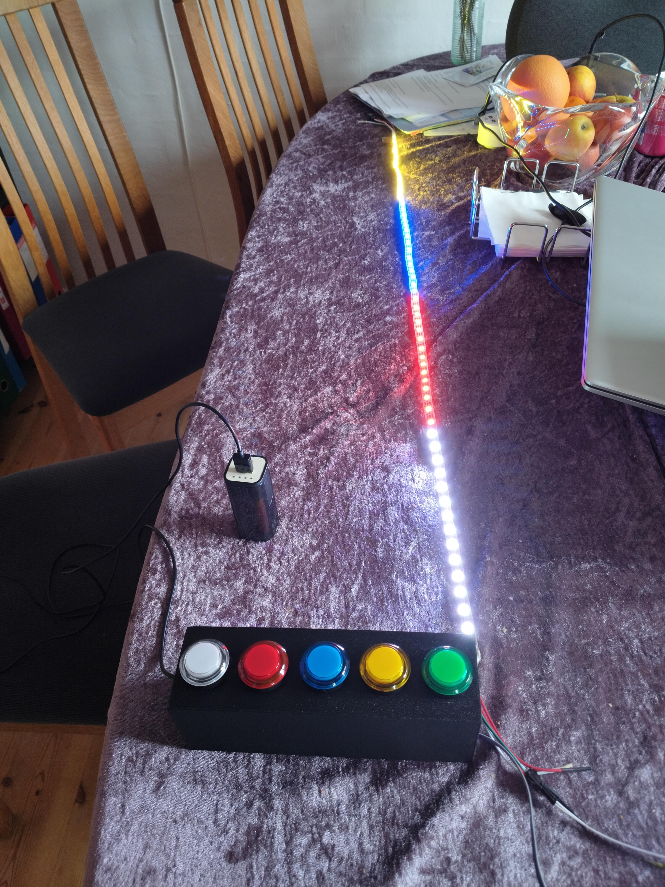

# 1D RGB Game
This marvelous game is very fun to play! Check it out!

Using WS2812 RGB LED's.

# Setup (Out of date)
1. Install Arduino IDE.
2. Download Adafruit Neopixel.
3. Upload to supported device.
4. Open the serial_controller.sh script on the correct serial port.
5. Play with 'A' to shoot or 'D' to change color!

Buy 5 arcade buttons and put them together in a box like the images below the video. :-)

# Video

  <video src="https://github.com/user-attachments/assets/063a46e0-384a-4913-bd53-0c98d604a6bb" controls preload></video>

# Images

  
  

